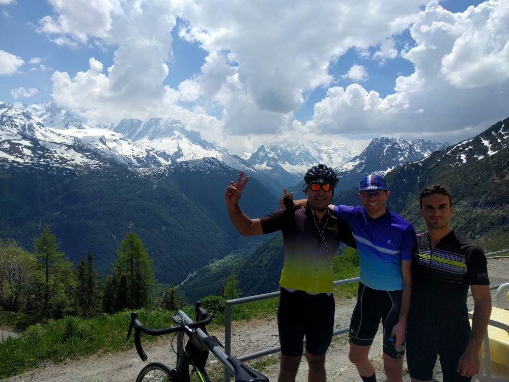

These road-bike rides originate from Chamonix and range from 60 to 155 km. They should be considered strictly-not-for-beginners. Ridden in late-May/early-June, the weather was good and warm or hot despite repeated poor forecasts. Refreshing rain regularly pours down in the late afternoons.

I was riding with friends I made cycling around the hills south of London — Dan, Andre and (for the first day) Jag.

* **Day 1 Lac d’Émosson** [Strava](https://www.strava.com/activities/1011240555) / [Video](https://www.relive.cc/view/1011240555) / [GPX](https://www.strava.com/activities/1011240555/export_gpx)
* **Day 2 Le Bettex** [Strava](https://www.strava.com/activities/1012616710) / [Video](https://www.relive.cc/view/1012616710) / [GPX](https://www.strava.com/activities/1012616710/export_gpx)
* **Day 3 Col de La Forclaz** [Strava](https://www.strava.com/activities/1014414002) / [Video](https://www.relive.cc/view/1014414002) / [GPX](https://www.strava.com/activities/1014414002/export_gpx)
* **Day 4 Col des Aravis e Col de La Colombière** [Strava](https://www.strava.com/activities/1016180749) / [Video](https://www.relive.cc/view/1016180749) / [GPX](https://www.strava.com/activities/1016180749/export_gpx)
* **Day 5 Lac de Vieux Émosson** [Strava](https://www.strava.com/activities/1017502930) / [Video](https://www.relive.cc/view/1017502930) / [GPX](https://www.strava.com/activities/1017502930/export_gpx)

# Day 1 — Lac d’Émosson
Up to Col des Montets, roughly 7km. They were working on the roads so had a big wait. The drop from Montets to the Swiss border is fun, and we gladly revisit it several times through the week. Border control was unattended except for dinosaur with a yellow cycle helmet. Shortly after, a left turn starts the first of many epic, unending climbs this week.

At the reservoir there is a huge vista of the valley we cycled through earlier. Sunburnt, we neck pricy coffee - 3.80 Swiss francs for an exspresso(sic). On the way down we take a detour through the village of Finhaut and down some steep tight switchbacks. Half way down we pass Dumbledore in yellow shorts walking the other way. He laughs aloud at us. I laughed aloud at him.

_Jag, Dan and Andre at top of Lac d’Emosson. Col des Montets and Mont Blanc behind them._
# Day 2 — Le Bettex

Heading west from Chamonix. Down through Vaudagne and on towards Passy. Passed a rock climbing area. Turning downhill before Passy to the bottom of the valley and headed through to Le Fayet.

On our way to Megève we saw signs to climb up to Le Bettex so we followed them. It was a steepish twisting route up to Le Bettex ski lift. Swift ride back down to catching a few bugs on the way to Saint Gervais for pastries and coffee.
Looped back home through Vaudagne which seemed easier than anticipated. Good wood stacks all over the place.
# Day 3 — Col de La Forclaz
Lost Andre on way up Col des Montets. His legs had gone.
Dan+I Crossed into Switzerland and cycled up through terrifying tunnel towards La Triste. Dropped down the epic Col de la Forclaz to Martigny. A good 10 minutes doing nothing but shooting down smooth sweeping mountain roads. From cool breeze at the top to dry heat at the bottom. On finishing, turned immediately back on the hill to start ascending. Needed food though so pulled into pizza restaurant about 1km up.
Margherite e Jus de pomme.

Filled the bottles and took a free sweet for morale. Next 8km took over an hour and was relentlessly uphill save a for a few generous hairpins. It was extremely hot to begin with, and without water fountains. Reaching the top of this one was hard-earned. The mountain water tasting better than ever. Replenishing descent through La Triste, back to the border and over Col des Montets to Chamonix.

Exhausted after climb from Martigny up Col de La Forclaz

# Day 4 — Col des Aravis e Col de La Colombière

Wanted epic, got epic. Found an organised ride after much inter-netting. It listed a bunch of destinations — Megève, Avaris, Colombière, Passy, Vaudagne. Sounded good and as I plugged the numbers it came to 155km (93mi).

Route to Megève similar to day 2 except not going up Bettex. After Megève descending to begin first of day’s cols. Col des Aravis was a struggle to climb, already a few miles on the clock and ready for a meal. Had to take breather to inhale a banana. Top of Aravis is relatively uninteresting save for a water tap with incredibly high pressure. Cow bells jangling in the field.

Brownie from Stef’s Wee Coffee House

Descended off the other side and stopped for lunch at Stef’s Wee Coffee House. These guys get ultimate kudos. Probably the best damn baked potato I’ve had, followed by probably the best damn brownie I’ve had. Plus great coffee (not best damn, though, still damn good). For those into brownies, I’ll have you know the cutting of the brownie was enough satisfaction in itself. Never mind eating it.

After enough loitering we took our bellies full of lunch up Col de la Colombière. Starting pretty much from the cafe for a good 15km up into the skies. Probably had the most cycling buddies on this section than at any other time all week. Felt rain at the top so did no hanging round. Little did we know what a treat we were in for. You might have thought descending to Martigny was top-notch, this was maybe double-top-notch! It was slightly slower but more to appreciate through changes of scenery.

View from Col de La Colombière towards La Cluses

The valley floor’s road from La Cluses to Passy was unpleasant. Lots of traffic, close overtaking. Filled bottles at Passy church. By now starting to rain heavily and legs severely drained. We drag ourselves across the valley ridge, interrupting a lone barman’s cigarette for a caffeine and sugar injection. Climbing up Vaudagne this time like having legs replaced with lead.

We got home. Double Poco Locos all round. Plus ice cream.

# Day 5 — Lac de Vieux Émosson

Remember day 1? Well we didn’t get to the top. Not in our minds anyway.
Cycling up to Lac d’Émosson we were in agreement that our bodies were simply putting up with us. There were no gold stars handed out. From the pinnacle of day 1’s ride, we observed our target, Lac de Vieux Émosson.

Ice cave ahead!

Without thinking too much we set out. Shortly after crossing the dam we approached our first obstacle. Loose rocky surface, larger than gravel, not far of slates. Couple of locals assure us road is suitable, they might have been laughing.
It turned back to proper surface, so we got on it. This was steep. Really steep. This was narrow. Really narrow. No sitting, and no getting near that edge. Around half way up there is another obstacle, an ice cave! After dismounting the bike only just scrapes through. A rocky cave awaits and seems like the gateway to the next challenge.

Rough ground with sheer drops comes next — I’m not cycling anymore. A waterfall showering clear icy water across the track now. Towing the line with my bike as close as I dare between the edge and the water. I inevitably get wet. A little further up comes a snow drift. Is this real? Carrying my bike over the snow and we approach the mid-way point of this top dam. I am informed — reassuringly — the road literally ends with a sheer drop here. Perhaps the entire road had been insinuating something? Going back down was a mix of triumph and fear. We’d done it; five days and still climbing stupid mountains.

Beer, food, rest, repeat. Time to go home.

Panorama from Lac d’Émosson

# Recommendations

For bikes, recommend either flying with a bike box through Geneva, or hiring there. We hired and from Slash Cycling based in Chamonix. The friendly owner, Guillaume, made it easy to get everything sorted and added a few suggestions being a cyclist himself.

When you’re hungry in Chamonix, there is only one place. Poco Loco. If you’re hungry than hunger itself, then order the double. But beware, it is huge. The buns here are great and the value is exceptional.

There is a toilet just beyond the Swiss border on the right after descending from Montets. Nothing particularly special about, we just ended up using it so often I felt it was worth mentioning.

There was inspiration for the above, first of all from our friend Jag, and he was inspired by Chamonet — https://www.chamonet.com/cycling/routes/.
